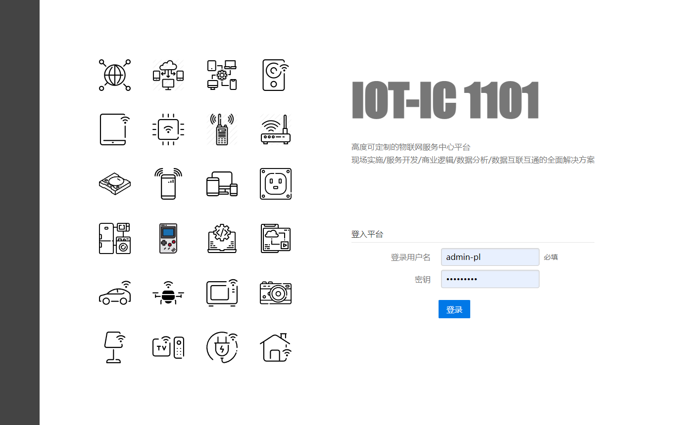
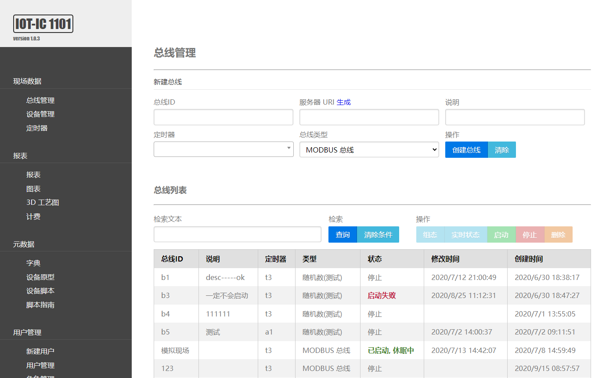

# IC1101

IC1101 is a web-based high-performance configuration software, which can configure the data logic bus online, such as Modbus logic bus. After the bus is configured, it can accept data immediately.
IC1101 can compile all resources into a single exe, and start this executable file directly when deploying.
IC1101 allows developers to use javascript to write data processing logic, accept the data sent by the device, perform pre-data processing through this js script, and then persist it.
Comes with basic data display and graphs.
Bus frame and DTU frame, easy to expand new bus type and DTU type.
Comes with a basic authorization module.

Online demo, open the website https://xboson.net/ select the menu 'Open Platform', 'IoT Platform', username: root password: 11118888

This project is supported by [Shanghai Zhubei Information Technology Co., Ltd.](https://xboson.net/).





## Dependencies

mongodb 3.6 or later, nodejs 12 or later.


## testing/development

`air`

## Run the test case

`go test ic1101/src/test`

## publish

`make www`

> make will compile the c encryption library, which must be compiled before testing.

> Parameters: `#cgo LDFLAGS: -lstdc++` can resolve compile-time exceptions
  `undefined reference to 'operator new[](unsigned long long)'`
  https://github.com/golang/go/issues/18460
  
> Rely on mingW dynamic library:
  libgcc_s_seh-1.dll, libstdc++-6.dll, libwinpthread-1.dll
  
  
## Configuration file

Create a file in the main program directory `ic1101.yaml`:

```
# server listening port
httpPort : 7700

# mongodb://[username:password@]host1[:port1][,...hostN[:portN]][/[defaultauthdb][?options]]
mongoURL : mongodb://localhost:27017/

# Name database
mongoDBname : ic1101

# Key to encrypt the session
salt : 12345678
```

Create a file in the main program directory `root-user.yaml`:

```
username: root
password: xxxxxxxx
```


# TODO

* The device property sheet supports width and order definition
* Log classification
* When the device version is behind the prototype version, it will be prompted in the list
* Customize data persistence, support more DB types


# Reference

* [命名](ttps://www.universeguide.com/galaxy/ic1101)
* [Web样式](https://purecss.io/layouts/)
* [air](https://github.com/cosmtrek/air)
* [MongoDB](https://docs.mongodb.com/manual/reference/method/db.collection.insertOne/)
* [Select2](https://select2.org/data-sources/ajax)
* [Logger](https://godoc.org/go.uber.org/zap)
* [chart](https://github.com/apache/incubator-echarts)
* [JavaScript](https://github.com/dop251/goja)
* [Markdown解析器](https://github.com/markdown-it/markdown-it)
* [语法高亮](https://prismjs.com/)[git](https://github.com/PrismJS/prism)
* [当成 win 服务运行](http://nssm.cc/download)
* [cgo 静态链接](https://blog.madewithdrew.com/post/statically-linking-c-to-go/)
* [cgo 调用示例](https://github.com/draffensperger/go-interlang)


# Linux

编译时依赖

```sh
yum -y install compat-libstdc++-33.x86_64 libstdc++.x86_64 libstdc++-devel.x86_64\
  libstdc++-static.x86_64  glibc-common.x86_64 glibc.x86_64 glibc-devel.x86_64\
  glibc-static.x86_64 gcc-c++ gcc
```

配置 golang

```sh
wget https://dl.google.com/go/go1.13.linux-amd64.tar.gz
tar -xzf go1.11.2.linux-amd64.tar.gz  -C /usr/local 
```

配置 nodejs

```sh
wget https://nodejs.org/dist/v12.18.2/node-v12.18.2-linux-x64.tar.xz
tar -xJvf node-v12.18.2-linux-x64.tar.xz  -C /usr/local/lib/nodejs 
```


# Automation communication protocol

Agreement to be implemented

## Program automation
* BSAP
* CC-Link
* CIP
* CANopen
* ControlNet
* DeviceNet
* DF-1
* DirectNET
* EtherCAT
* Ethernet Global Data (EGD)
* Ethernet Powerlink
* EtherNet/IP
* FINS
* FOUNDATION fieldbus
* GE SRTP
* HART Protocol
* Honeywell SDS
* HostLink
* INTERBUS
* MECHATROLINK
* MelsecNet
* Optomux
* PieP
* PROFINET IO
* SERCOS interface
* SERCOS III
* Sinec H1
* SynqNet
* TTEthernet
* RAPIEnet

## industrial control system
* Modbus
  * [实现](github.com/yanmingsohu/modbus)
  * [modbus从站模拟器](https://www.modbusdriver.com/diagslave.html)
  * [modbus开发资料](http://www.dalescott.net/modbus-development/)
* OPC DA
  * [基于DCOM, 待验证*实现](https://github.com/konimarti/opc)
  * [服务端c++](https://github.com/technosoftware-gmbh/opc-daae-server-sdk)
  * [服务端, 古旧代码, 参考](https://github.com/gmist/frl)
* OPC HDA
* OPC UA
  * [基于TCP, 待验证*实现](https://github.com/gopcua/opcua)
* MTConnect

## Intelligent Building
* BACnet
* 1-Wire
* C-Bus
* DALI
* DSI
* KNX
* LonTalk
* oBIX
* VSCP
* X10
* xAP
* ZigBee

## Transmission and Distribution Communication Protocol
* IEC 60870-5
* DNP3
* IEC 60870-6
* IEC 61850
* IEC 62351
* Profibus

## smart meter
* M-Bus 
  * [实现](https://github.com/rscada/libmbus) 
  * [文档](https://m-bus.com/documentation-wired/01-introduction)
* ZigBee Smart Energy 2.0
* ANSI C12.18
* IEC 61107
* DLMS/IEC 62056

## Vehicle communication
* CAN
  * [待验证*实现](https://github.com/brutella/can)
* FMS
* FlexRay
* IEBus
* J1587
* J1708
* J1939
* Keyword Protocol 2000
* LIN
* MOST
* NMEA 2000
* VAN

## Other
* MQTT
  * [client 实现](https://github.com/eclipse/paho.mqtt.golang)
  * [server](https://github.com/VolantMQ/volantmq)
  * [文档](https://mcxiaoke.gitbooks.io/mqtt-cn/content/mqtt/01-Introduction.html)


## DTU
* [北京科慧铭远自控](http://www.msi-automation.com/jishuzhichi.html)